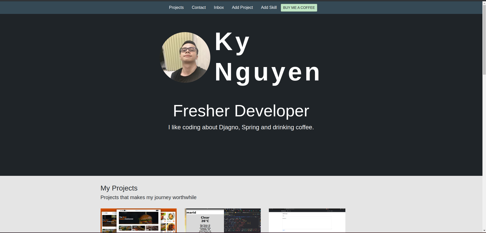
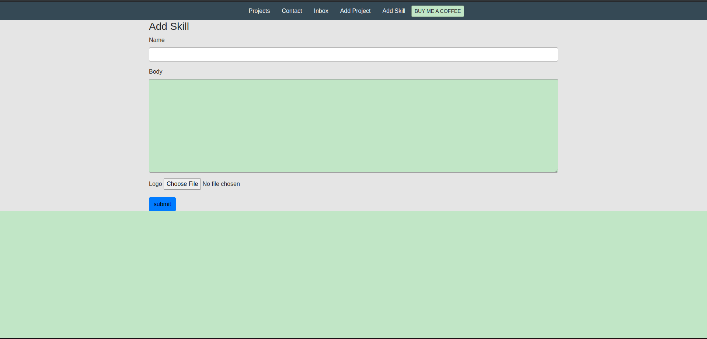

mg_2.png](img_2.png)

Hello, This is project about Building My Portfolio Website.
So you can add project and your skill.
User can inbox, message, comment and Endorsement on project !

I built my website from sqlite database
You can run db for (postgresql, mongodb,...)
You can run it with docker !
